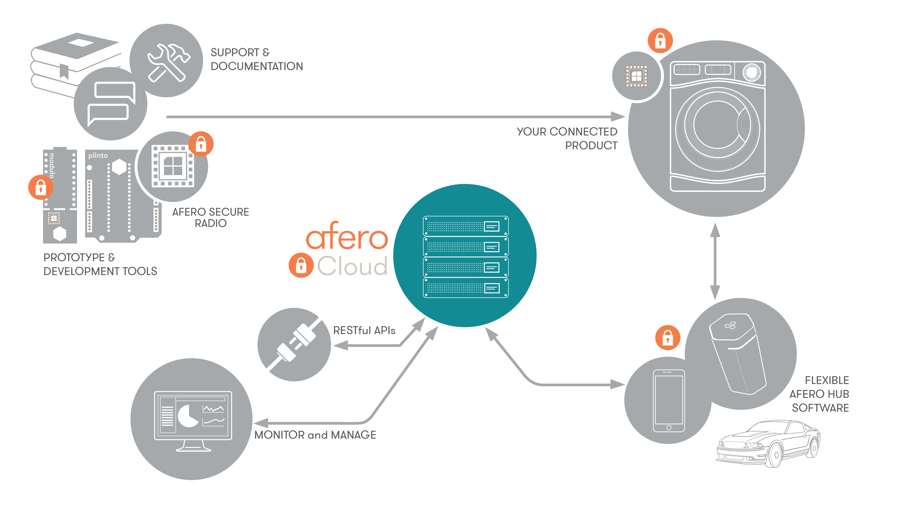

# Afero IoT Platform Overview

Afero builds integrated hardware, software, and cloud services for IoT connectivity and data analytics. The Afero turnkey platform incorporates a secure radio, Bluetooth® low energy and/or Wi-Fi connectivity, scalable cloud services, and a range of development tools that enable companies and developers to quickly prototype and build connected devices.

The Afero IoT Platform is vertically integrated, giving developers a solution that combines security and connectivity at the three key touch points for all connected devices:

<ul class="af-ul">
<li>Product (embedded secure radio)</li>
<li>Mobile (app-level monitoring and control)</li>
<li>Cloud (web API)</li>
</ul>

This vertical integration accelerates the creation of connected devices by minimizing the investment normally required for software development and testing – while making sure you have a secure and scalable solution.

Below you’ll find more detail on each of the components.

## Prototype & Development Environment

To build or prototype Afero powered, connected products, you can choose from the following options:

<ul class="af-ul">
<li>An Afero Modulo-1 or Modulo-1B development board, to be used standalone or in conjunction with an external board equipped with its own microcontroller.</li>
<li>An Afero Modulo-2 reference design board, to be connected to any Microchip microcontroller with an XPRO interface.</li>
<li>An Afero Plinto development board, to be used in conjunction with an Arduino board.</li>
<li>An Afero Secure Radio module (ASR-1 or ASR-2KL), to be directly integrated into a product and used either standalone (multiple I/O ports provided) or in conjunction with a host microcontroller.</li>
</ul>

You can order Afero development boards and tools using the vendors and part numbers listed on the [Afero Hardware Products](../Hardware) page.

The Afero Secure Radio (ASR) can be embedded in new and existing product designs. It comes programmed with authentication, encryption, and connection management software, ensuring a reliable connection to the Afero Cloud.

Read more about our development tools in the [Profile Editor User Guide](../Projects), the [Inspector User Guide](../Inspector), the [Console User Guide](../Console), and [Afero Cloud API](../CloudAPIs).

## Your Connected Product

The Afero mobile app, available for both Android and iOS smartphones, gives users control over their smart devices and services from their phones. The mobile app also works as a hub, securely sending and receiving messages to and from the Afero Cloud on behalf of the smart device.

## Dynamic Hub Technology

The Afero Secure Hub technology ensures secure and reliable communication between ASR and the Afero Cloud. You have three hub options:

<ul class="af-ul">
<li>Standalone Afero Secure Hub</li>
<li>Hub software included in the mobile app</li>
<li>Embedded hub hardware/software in third-party devices</li>
</ul>

The hub communicates with ASR over Bluetooth® low energy technology or Wi-Fi, then to the Afero Cloud over Wi-Fi or LTE.

## Afero Cloud

The Afero Cloud provides secure, managed services:

<ul class="af-ul">
<li>The datastore is a Highly Available (HA), globally distributed, encrypted long-term storage solution.</li>
<li>Partners have the ability to deploy software updates to the devices already in the market via Over-the-Air (OTA) updates.</li>
<li>As Afero continues to update and upgrade its software platform, all customers and their devices will have access to the latest cloud software.</li>
</ul>

Our Secure RESTful API is SSL encrypted and protected using the two-legged authentication model of the OAuth 2.0 specification. The Cloud API lets you securely authenticate your customers using custom applications so they can control the Afero powered devices associated with their accounts.

<strong>&#8674;</strong> <em>Next:</em>&nbsp;&nbsp;[Core Development Concepts](../CoreConcepts)